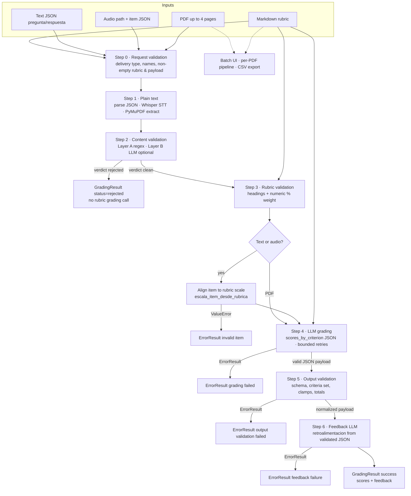

# Grader Agent

Multimodal **AI-assisted grading** demo for educators: propose scores and short feedback from a **Markdown rubric** against **typed text**, **recorded audio** (transcribed with speech-to-text), or **PDF hand-ins** (plain text extracted from the first pages).

This repository is structured as a small **product-shaped** Python service: a minimal Flask UI, business logic under `src/grader_agent`, and tests that mock LLM clients so the suite runs **without live API calls**.

---

## What it does

- **Rubric upload** — Save an active rubric (`.md`) used for all subsequent grading in the session.
- **Text grading** — For one question/item at a time, returns suggested score, max score from the rubric, and student-facing feedback JSON.
- **Audio grading** — Uploads audio, transcribes it with **OpenAI Whisper**, then runs the same text pipeline on the transcript.
- **PDF grading** — Extracts text (PyMuPDF), scores each rubric criterion via **OpenRouter**, and aggregates totals.
- **Batch folder flow** — Optional UI path for many PDFs with Moodle-style folder names; exports a CSV for spreadsheets.
- **Results log** — Appends JSON results under the configured data directory (default `./data/resultados.json`).

---

## Why it matters

Teachers repeatedly interpret the same rubric across many answers and documents. This tool **automates the mechanical parts** (reading structure, drafting scores, generating feedback language) so instructors can focus on **judgment, exceptions, and pedagogy**.

It is **not** a gradebook replacement, an official LMS, or a guarantee of fair or bias-free outcomes.

---

## Main workflows

End-to-end sequence for a single grading request: **request checks → plain text → student-content policy → rubric checks → LLM scores → deterministic output validation → LLM feedback**. Batch PDF export reuses the same pipeline per file and then writes CSV.



1. **Upload rubric** → stored as `data/rubrics/rubrica_activa.md` (paths configurable).
2. **Grade one modality** → JSON response; optional append to results log.
3. **Optional** → Clear results, export CSV after batch PDF grading.

---

## Validation stages (complete)

Every graded request follows the same gates (see [`GradingPipeline.run`](src/grader_agent/pipeline.py)). There is **no UI bypass** for any of them.

| Stage | Step | Service / module | What is validated |
|--------|------|-------------------|-------------------|
| **Request** | 0 | [`pipeline._validate_request`](src/grader_agent/pipeline.py) | `delivery_type`, non-empty student name, rubric body, submission `content`. Text: JSON with `pregunta`/`respuesta`. Audio: path + item (or single-criterion rubric). |
| **Audio file** | 1 | [`TranscriptionService`](src/grader_agent/services/transcription.py) | Path exists, allowed extension (Whisper subset), max size (25 MiB), then API call; failures surface as `ErrorResult`. |
| **PDF file** | 1 | [`PDFExtractionService`](src/grader_agent/services/pdf_extraction.py) | Opens as PDF, **≤ 4 pages**, concatenated `get_text()` non-empty (no extractable text → error). |
| **Student body** | 2 | [`ContentValidationService`](src/grader_agent/services/content_validation.py) | **Layer A:** regex policy scan ([`guardrails/regex_layer.py`](src/grader_agent/guardrails/regex_layer.py)). **Layer B:** optional OpenRouter JSON verdict when A is clean and `SKIP_LLM_VALIDATION` is false ([`validacion_capa_b`](src/grader_agent/prompts/validacion_capa_b.md)). Rejection returns **without** calling the grader. |
| **Rubric file** | 3 | [`RubricValidationService`](src/grader_agent/services/rubric_validation.py) | Non-empty Markdown, at least one `#` heading, at least one numeric `%` weight pattern. |
| **Item vs rubric** | — (between 3 and 4) | [`escala_item_desde_rubrica`](src/grader_agent/grading/text.py) | **Text and audio only:** the question/item string must map to the rubric’s item scale; otherwise `ErrorResult` (`ERROR_TYPE_VALIDATION`). PDF skips this (full-criterion path). |
| **LLM grading shape** | 4 | [`GradingService`](src/grader_agent/services/grading.py) + retries in pipeline | Parses model output as JSON; **bounded retries** when the failure looks like a recoverable bad shape / invalid model output (see `_grading_internal_recoverable` in [`pipeline.py`](src/grader_agent/pipeline.py)). |
| **Grading JSON output** | 5 | [`OutputValidationService`](src/grader_agent/services/output_validation.py) | **Deterministic, no LLM:** object with non-empty `scores_by_criterion`; each row has required keys; `criterion_name` set must **exactly** match expected criteria (from rubric metadata, or `allowed_criterion_names` for single text/audio items); `level_percentage` 0–100 (clamp + warning); `weighted_score` clamped to rubric max when known (warning if unknown max); `criterion_weight` clamped 0–100; recomputed `total_weighted_score` / `total_max_score`. On hard shape mismatch → `ErrorResult` (typically “reintentar la calificación”). |
| **Feedback** | 6 | [`FeedbackService`](src/grader_agent/services/feedback.py) | Uses **only** the **step-5–validated** payload; if the feedback call fails, the pipeline returns `ErrorResult` (no silent fallback to raw model scores in the success object). |

**Distinction:** Step **2** moderates **student-submitted text**. Step **5** validates **grading JSON** from the model (schema and numeric bounds vs the rubric). They are independent layers; output validation is **not** “layer C” of content moderation (see also the note under [Two-layer content validation](#two-layer-content-validation)).

**Diagram short-circuits:** the Mermaid chart omits **step 1** failure edges (invalid audio file, unreadable PDF, empty extraction) and **step 0** failures; those return `ErrorResult` immediately. **Startup:** [`validate_llm_api_keys_for_runtime`](src/grader_agent/settings.py) in `create_app()` requires `OPENAI_API_KEY` and `OPENROUTER_API_KEY` unless the app runs in testing mode.

---

## Architecture

| Layer | Location | Role |
|--------|-----------|------|
| Web / HTTP | [`app/`](app/) | Flask `create_app`, routes, templates, HTTP ↔ pipeline adapters |
| Domain logic | [`src/grader_agent/`](src/grader_agent/) | Pipeline orchestration, grading, prompts, transcription, CSV, Moodle path parsing |
| Prompts | [`src/grader_agent/prompts/`](src/grader_agent/prompts/) | Markdown system prompts (overridable via `GRADER_AGENT_PROMPTS_DIR`) |
| Samples | [`samples/`](samples/) | Example rubrics only (not loaded automatically) |

Configuration and paths are centralized in [`src/grader_agent/settings.py`](src/grader_agent/settings.py). Shared chat calls with JSON responses live in [`src/grader_agent/llm/client_calls.py`](src/grader_agent/llm/client_calls.py). The Flask app wires a single [`GradingPipeline`](src/grader_agent/pipeline.py) via [`app/grading_pipeline_factory.py`](app/grading_pipeline_factory.py).

---

## Tech stack

- **Python** 3.11+
- **Flask** — HTTP API and demo UI
- **OpenRouter** — Chat Completions (`response_format: json_object`) for grading, student feedback, and optional LLM content validation (layer B). Uses the official **OpenAI Python SDK** with `base_url=https://openrouter.ai/api/v1`.
- **OpenAI** — **Audio transcriptions only** (Whisper-compatible `audio.transcriptions.create`) against the default `api.openai.com` host.
- **PyMuPDF (`fitz`)** — PDF text extraction
- **pytest** — Unit tests with mocks

---

## Grading pipeline (seven steps)

The orchestrator runs **steps 0–6** in order for every request (see [`GradingPipeline.run`](src/grader_agent/pipeline.py)). A full gate-by-gate description (including the text/audio **item ↔ rubric** check that runs **after** step 3 and **before** step 4) is in [Validation stages (complete)](#validation-stages-complete).

| Step | Name | Responsibility |
|------|------|----------------|
| **0** | Request validation | Coerce `delivery_type`, ensure non-empty student name, rubric, and submission payload. |
| **1** | Acquire plain text | Text: parse JSON `pregunta`/`respuesta`. Audio: resolve path + item, **Whisper** transcribe. PDF: **PyMuPDF** extract text (≤ 4 pages). |
| **2** | Content validation | **Two-layer policy** on submission text (see below). May return a structured **rejection** without calling the grader. |
| **3** | Rubric validation | Lightweight Markdown checks (headings, at least one numeric `%` weight). |
| **—** | *(text/audio only, before 4)* | Resolve the rubric item/scale for the submitted question (`escala_item_desde_rubrica`); **validation error** if the item does not match the rubric. PDF flow skips this (full criterion list grading). |
| **4** | LLM grading | OpenRouter JSON `scores_by_criterion`; **bounded retries** on recoverable JSON/shape failures (`_grading_internal_recoverable`). |
| **5** | Output validation | **Deterministic** checks on model output: [`OutputValidationService`](src/grader_agent/services/output_validation.py) — required row keys, exact criterion set vs rubric (or single allowed name for text/audio), clamps, recomputed totals; returns normalized payload + warnings or `ErrorResult`. |
| **6** | Feedback | OpenRouter generates Spanish student-facing `retroalimentacion` from rubric + **step-5–validated** grading JSON only. |

---

## Two-layer content validation

Applied to the **student deliverable text** (transcript or extracted PDF text), before rubric checks and grading. For every validation type in the product (request, content, rubric, item alignment, grading retries, **output JSON**, feedback), see [Validation stages (complete)](#validation-stages-complete).

1. **Layer A (regex)** — Deterministic scan for high-confidence injection, exfiltration, obfuscation, and severe policy signals ([`guardrails/regex_layer.py`](src/grader_agent/guardrails/regex_layer.py)). No tokens; fast; may false-positive on edge academic wording (corpus-tested separately).
2. **Layer B (LLM)** — If layer A is clean and `SKIP_LLM_VALIDATION` is not truthy, a small JSON verdict model on **OpenRouter** (`VALIDATION_LLM_MODEL`) classifies the submission using [`validacion_capa_b`](src/grader_agent/prompts/validacion_capa_b.md).

**Note:** Output validation (step 5) is **not** “layer C” moderation; it is **schema and bounds** checking of grading JSON, separate from student-content policy.

---

## Setup

```bash
python -m venv .venv
.venv\Scripts\activate          # Windows
pip install -e ".[dev]"
```

Run the demo server:

```bash
python -m app
# or
flask --app app:create_app run
```

### Configuration (two API keys)

Copy [`.env.example`](.env.example) to `.env` and set **both** keys for local runs (unless `TESTING=true`, e.g. pytest):

| Key | Used for |
|-----|----------|
| **`OPENAI_API_KEY`** | Direct OpenAI API: **Whisper / audio transcription** only. |
| **`OPENROUTER_API_KEY`** | OpenRouter: **grading**, **feedback**, and **layer B** content validation chat calls. |

`create_app()` calls `validate_llm_api_keys_for_runtime()` and raises a clear error if either key is missing in non-testing mode.

---

## Environment variables

| Variable | Required | Description |
|----------|----------|-------------|
| `OPENAI_API_KEY` | **Yes** (runtime) | OpenAI secret for **transcription** (`api.openai.com`). |
| `OPENROUTER_API_KEY` | **Yes** (runtime) | OpenRouter secret for **all chat** completions (grading, retro, validation). |
| `GRADER_DATA_DIR` | No | Base directory for writable data (default `./data`). Contains `rubrics/` and `resultados.json`. |
| `LLM_MODEL` | No | Primary chat model on OpenRouter (default `gpt-4o`). `GRADER_CHAT_MODEL` is still read if `LLM_MODEL` is unset. |
| `VALIDATION_LLM_MODEL` | No | Model for layer B validation (default `gpt-4o-mini`). |
| `SKIP_LLM_VALIDATION` | No | `1`/`true`/`yes` skips layer B after a clean regex layer (default off). |
| `GRADING_MAX_TOKENS` | No | Max output tokens for grading-style calls (default `8192`). |
| `FEEDBACK_MAX_TOKENS` | No | Max output tokens for feedback-style calls (default `4096`). |
| `VALIDATION_MAX_TOKENS` | No | Max output tokens for validation calls (default `2048`). |
| `GRADER_TRANSCRIPTION_MODEL` | No | Speech model (default `whisper-1`). |
| `GRADER_TRANSCRIPTION_LANGUAGE` | No | ISO language hint for transcription (default `es`). |
| `GRADER_AGENT_PROMPTS_DIR` | No | Override directory for prompt `.md` files. |
| `GRADER_SCORE_TEMPERATURE` | No | Temperature for numeric score calls (default `0`). |
| `GRADER_RETRO_TEMPERATURE` | No | Temperature for feedback text (default `0.8`). |
| `GRADER_MAX_COMPLETION_ESCALA` | No | Max output tokens for rubric item location. |
| `GRADER_MAX_COMPLETION_PUNTAJE` | No | Max output tokens for score-only JSON. |
| `GRADER_MAX_COMPLETION_LISTAR` | No | Max output tokens for listing PDF criteria. |
| `GRADER_MAX_COMPLETION_RETRO` | No | Max output tokens for feedback JSON. |
| `OPENAI_RATE_LIMIT_MAX_RETRIES` | No | Retries on 429 rate limits (not `insufficient_quota`). |
| `LOG_LEVEL` | No | Logging level for the root logger. |
| `LOG_FILE_PATH` | No | If set, append logs to this file in addition to stderr. |
| `WERKZEUG_LOG_QUIET` | No | Set to `1` to reduce duplicate access logs. |
| `FLASK_DEBUG` | No | `1` / `true` enables Flask debug server flag. |

See [`.env.example`](.env.example) for a full template.

---

## Known limitations

- **Model behavior** — Scores and wording are **non-deterministic** suggestions; always review before recording official grades.
- **PDF** — Only **plain extracted text** is graded (no diagrams or strict layout fidelity); **max four pages** per file in code.
- **Language** — Prompts and UI strings are largely **Spanish**; transcription defaults to Spanish (`GRADER_TRANSCRIPTION_LANGUAGE`).
- **No teacher bypass** — There is **no privileged “docente” path** to skip pipeline steps, guardrails, or output validation from the UI or API; every graded request follows the same sequence.
- **No concurrency guarantees** — Single-process demo: **no locking**, queues, or multi-tenant isolation; concurrent uploads may race on the active rubric file or JSON log.
- **Rubric trust model** — The active rubric is treated as **trusted teacher content** beyond light structure checks. **Malicious or misleading rubric text** (e.g. hidden instructions) is an **accepted residual risk**; the app does not sandbox rubric Markdown against the same student-facing policy layers.
- **Network and quota** — Depends on OpenAI (transcription) and OpenRouter (chat) availability, rate limits, and billing.

---

## Example inputs / outputs

**Input (rubric excerpt, Markdown):**

```markdown
## Question 1 — Operating systems (10 points)
**Expected answer:** An OS manages hardware and provides services to programs.
```

**Input (student text):** Short paragraph describing resource management.

**Output (JSON, simplified):**

```json
{
  "pregunta": "Question 1 — Operating systems (10 points)",
  "puntaje_obtenido": 8,
  "puntaje_maximo": 10,
  "retroalimentacion": "…",
  "alumno": "Student name"
}
```

Example full rubrics: [`samples/rubrics/`](samples/rubrics/).

---

## Future improvements

- **CI** (GitHub Actions) running `pytest` on push.
- **Dockerfile** for reproducible demos.
- **CLI** batch mode separate from the browser.
- **Structured logging / tracing** for request-level observability.
- **Stronger fairness tooling** (second rater, rubric versioning, audit trail).

---

## Tests

```bash
pytest
```

Integration smoke (real API), opt-in:

```bash
set OPENAI_API_KEY=sk-...   # real key
set OPENROUTER_API_KEY=sk-or-v1-...
pytest -m integration
```

---

## License

Specify your license here if you publish the portfolio publicly.
