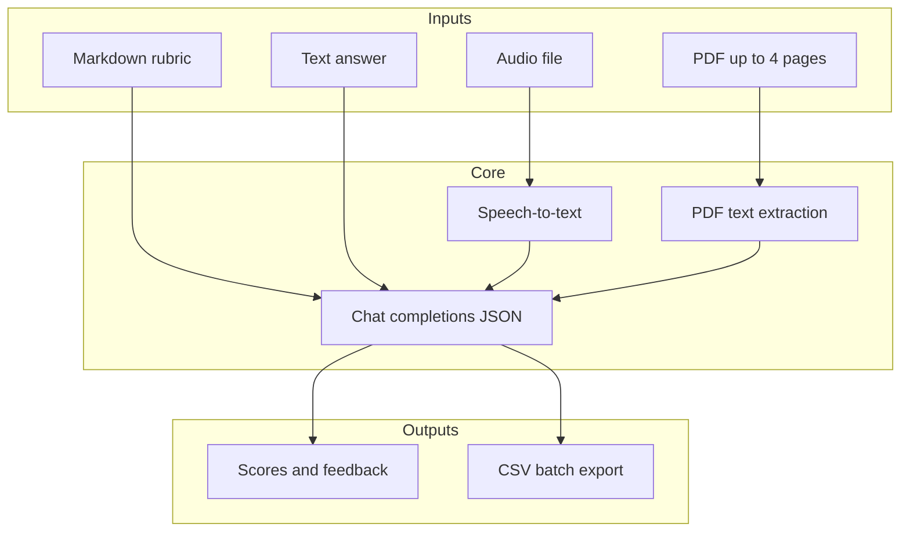

# Grader Agent

Multimodal **AI-assisted grading** demo for educators: propose scores and short feedback from a **Markdown rubric** against **typed text**, **recorded audio** (transcribed with speech-to-text), or **PDF hand-ins** (plain text extracted from the first pages).

This repository is structured as a small **product-shaped** Python service: a minimal Flask UI, business logic under `src/grader_agent`, and tests that mock OpenAI so the suite runs **without live API calls**.

---

## What it does

- **Rubric upload** — Save an active rubric (`.md`) used for all subsequent grading in the session.
- **Text grading** — For one question/item at a time, returns suggested score, max score from the rubric, and student-facing feedback JSON.
- **Audio grading** — Uploads audio, transcribes it, then runs the same text pipeline on the transcript.
- **PDF grading** — Extracts text (PyMuPDF), infers criteria from the rubric, scores each criterion, and aggregates totals.
- **Batch folder flow** — Optional UI path for many PDFs with Moodle-style folder names; exports a CSV for spreadsheets.
- **Results log** — Appends JSON results under the configured data directory (default `./data/resultados.json`).

---

## Why it matters

Teachers repeatedly interpret the same rubric across many answers and documents. This tool **automates the mechanical parts** (reading structure, drafting scores, generating feedback language) so instructors can focus on **judgment, exceptions, and pedagogy**.

It is **not** a gradebook replacement, an official LMS, or a guarantee of fair or bias-free outcomes.

---

## Main workflows



1. **Upload rubric** → stored as `data/rubrics/rubrica_activa.md` (paths configurable).
2. **Grade one modality** → JSON response; optional append to results log.
3. **Optional** → Clear results, export CSV after batch PDF grading.

---

## Architecture

| Layer | Location | Role |
|--------|-----------|------|
| Web / HTTP | [`app/`](app/) | Flask `create_app`, routes, templates |
| Domain logic | [`src/grader_agent/`](src/grader_agent/) | Grading, prompts, transcription, CSV, Moodle path parsing |
| Prompts | [`src/grader_agent/prompts/`](src/grader_agent/prompts/) | Markdown system prompts (overridable via `GRADER_AGENT_PROMPTS_DIR`) |
| Samples | [`samples/`](samples/) | Example rubrics only (not loaded automatically) |

Configuration and paths are centralized in [`src/grader_agent/settings.py`](src/grader_agent/settings.py). Shared chat calls with JSON responses live in [`src/grader_agent/llm/client_calls.py`](src/grader_agent/llm/client_calls.py).

---

## Tech stack

- **Python** 3.11+
- **Flask** — HTTP API and demo UI
- **OpenAI API** — Chat Completions (JSON mode) and Audio Transcriptions
- **PyMuPDF (`fitz`)** — PDF text extraction
- **pytest** — Unit tests with mocks

---

## Setup

```bash
python -m venv .venv
.venv\Scripts\activate          # Windows
pip install -e ".[dev]"
```

Run the demo server:

```bash
python -m app
# or
flask --app app:create_app run
```

Copy [`.env.example`](.env.example) to `.env` and set at least **`OPENAI_API_KEY`**. Without it, `create_app()` raises a clear error (tests set `TESTING=true` / use a fake key via `conftest.py`).

---

## Environment variables

| Variable | Required | Description |
|----------|----------|-------------|
| `OPENAI_API_KEY` | **Yes** (runtime) | OpenAI secret key. |
| `GRADER_DATA_DIR` | No | Base directory for writable data (default `./data`). Contains `rubrics/` and `resultados.json`. |
| `GRADER_CHAT_MODEL` | No | Chat model for grading (default `gpt-4o`). |
| `GRADER_TRANSCRIPTION_MODEL` | No | Speech model (default `whisper-1`). |
| `GRADER_TRANSCRIPTION_LANGUAGE` | No | ISO language hint for transcription (default `es`). |
| `GRADER_AGENT_PROMPTS_DIR` | No | Override directory for prompt `.md` files. |
| `GRADER_SCORE_TEMPERATURE` | No | Temperature for numeric score calls (default `0`). |
| `GRADER_RETRO_TEMPERATURE` | No | Temperature for feedback text (default `0.8`). |
| `GRADER_MAX_COMPLETION_ESCALA` | No | Max output tokens for rubric item location. |
| `GRADER_MAX_COMPLETION_PUNTAJE` | No | Max output tokens for score-only JSON. |
| `GRADER_MAX_COMPLETION_LISTAR` | No | Max output tokens for listing PDF criteria. |
| `GRADER_MAX_COMPLETION_RETRO` | No | Max output tokens for feedback JSON. |
| `OPENAI_RATE_LIMIT_MAX_RETRIES` | No | Retries on 429 rate limits (not `insufficient_quota`). |
| `LOG_LEVEL` | No | Logging level for app loggers. |
| `WERKZEUG_LOG_QUIET` | No | Set to `1` to reduce duplicate access logs. |
| `FLASK_DEBUG` | No | `1` / `true` enables Flask debug server flag. |

See [`.env.example`](.env.example) for a full template.

---

## Example inputs / outputs

**Input (rubric excerpt, Markdown):**

```markdown
## Question 1 — Operating systems (10 points)
**Expected answer:** An OS manages hardware and provides services to programs.
```

**Input (student text):** Short paragraph describing resource management.

**Output (JSON, simplified):**

```json
{
  "pregunta": "Question 1 — Operating systems (10 points)",
  "puntaje_obtenido": 8,
  "puntaje_maximo": 10,
  "retroalimentacion": "…",
  "alumno": "Student name"
}
```

Example full rubrics: [`samples/rubrics/`](samples/rubrics/).

---

## Limitations

- **Model behavior** — Scores and wording are **non-deterministic** suggestions; always review before recording official grades.
- **PDF** — Only **plain extracted text** is graded (no diagrams or strict layout fidelity); **max four pages** per file in code.
- **Language** — Prompts and UI strings are largely **Spanish**; transcription defaults to Spanish (`GRADER_TRANSCRIPTION_LANGUAGE`).
- **Single-tenant demo** — One active rubric file and local JSON log; not built for concurrent multi-tenant production.
- **Network and quota** — Depends on OpenAI availability, rate limits, and billing.

---

## Future improvements

- **CI** (GitHub Actions) running `pytest` on push.
- **Dockerfile** for reproducible demos.
- **CLI** batch mode separate from the browser.
- **Structured logging / tracing** for request-level observability.
- **Stronger fairness tooling** (second rater, rubric versioning, audit trail).

---

## Tests

```bash
pytest
```

Integration smoke (real API), opt-in:

```bash
set OPENAI_API_KEY=sk-...   # real key
pytest -m integration
```

---

## License

Specify your license here if you publish the portfolio publicly.
